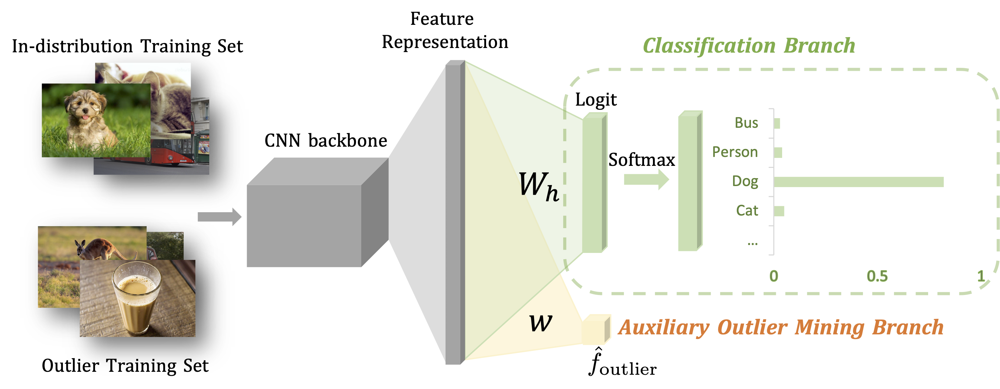

# Out-of-distribution Detection with Posterior Sampling
This project is for the paper: [POEM: Out-of-distribution Detection with Posterior Sampling published at ICML 2022](https://arxiv.org/abs/2206.13687) (long talk). Some parts of the codebase are adapted from [ODIN](https://github.com/facebookresearch/odin), [Outlier Exposure](https://github.com/hendrycks/outlier-exposure), [Deep Mahalanobis Detector](https://github.com/pokaxpoka/deep_Mahalanobis_detector) and [NTOM](https://github.com/jfc43/informative-outlier-mining).

## Required Packages

The following packages are required to be installed:

- [PyTorch](https://pytorch.org/)
- [Scipy](https://github.com/scipy/scipy)
- [Numpy](http://www.numpy.org/)
- [Sklearn](https://scikit-learn.org/stable/)

Our experiments are conducted on Ubuntu Linux 20.04 with Python 3.8.

## Method Overview




## In-distribution and Auxiliary Outlier Datasets

- In-distribution training set:
  - [CIFAR](https://www.cs.toronto.edu/~kriz/cifar.html): included in PyTorch.

* Auxiliary outlier training set:

  * [80 Million Tiny Images](https://groups.csail.mit.edu/vision/TinyImages/): to download **80 Million Tiny Images** dataset. After downloading it, place it in this directory: `datasets/unlabeled_datasets/80M_Tiny_Images`


  * ImageNet-RC (Downsampled ImageNet Datasets](https://patrykchrabaszcz.github.io/Imagenet32/): we use the ImageNet64x64, which can be downloaded from [ImageNet Website](http://image-net.org/download-images). After downloading it, place it in this directory: `datasets/unlabeled_datasets/ImageNet`. 
## Out-of-distribution Test Datasets

We provide links and instructions to download each dataset:

* [SVHN](http://ufldl.stanford.edu/housenumbers/test_32x32.mat): download it and place it in the folder of `datasets/ood_datasets/svhn`. Then run `python select_svhn_data.py` to generate test subset.
* [Textures](https://www.robots.ox.ac.uk/~vgg/data/dtd/download/dtd-r1.0.1.tar.gz): download it and place it in the folder of `datasets/ood_datasets/dtd`.
* [Places365](http://data.csail.mit.edu/places/places365/test_256.tar): download it and place it in the folder of `datasets/ood_datasets/places365/test_subset`. We randomly sample 10,000 images from the original test dataset.
* [LSUN-C](https://www.dropbox.com/s/fhtsw1m3qxlwj6h/LSUN.tar.gz): download it and place it in the folder of `datasets/ood_datasets/LSUN`.
* [LSUN-R](https://www.dropbox.com/s/moqh2wh8696c3yl/LSUN_resize.tar.gz): download it and place it in the folder of `datasets/ood_datasets/LSUN_resize`.
* [iSUN](https://www.dropbox.com/s/ssz7qxfqae0cca5/iSUN.tar.gz): download it and place it in the folder of `datasets/ood_datasets/iSUN`.

For example, run the following commands in the **root** directory to download **LSUN-C**:
```
cd datasets/ood_datasets
wget https://www.dropbox.com/s/fhtsw1m3qxlwj6h/LSUN.tar.gz
tar -xvzf LSUN.tar.gz
```

## Quick Start 

For example, to test the model trained with POEM at 100 epochs on CIFAR-100, please download the corresponding checkpoint to `./checkpoints/CIFAR-100/POEM_Sample_1/checkpoint_100.pth.tar`. You can also train from scratch with `train_poem.py`. Note that for each ID dataset, posterior sampling hyperparameters need to be tuned, especially the ones controlling the variances for noises and weights: `sigma` and `sigma_n`. To reproduce the results in the paper, we provide checkpoints for tuned models [here](https://www.dropbox.com/sh/tsqwbob249gouzy/AABS21uLcB1TdwoHxMQpOXpia?dl=0).


To evaluate the OOD detection performance of POEM, for example, with a checkpoint named `POEM_Sample_1`:

```python
# Generate evaluation results for POEM:
python get_score.py --name POEM_Sample_1 --in-dataset CIFAR-10 --model-arch densenet --test_epochs 100

# Present OOD detection metrics based on results:
python get_results.py --name POEM_Sample_1  --in-dataset CIFAR-10 --test_epochs 100
```

### For bibtex citations
If you find our work helpful for your research, please consider citing our paper:
```
@inproceedings{ming2022poem,
  author={Ming, Yifei  and Fan, Ying  and Li, Yixuan},
  title={POEM: Out-of-distribution Detection with Posterior Sampling},
  booktitle={International Conference on Machine Learning},
  year={2022},
  organization={PMLR}
}
```

### Issues and further discussions

Please create an issue for code-related questions. For clarification and further discussions, free feel to drop an email at ming5@wisc.edu.
